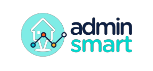

# AdminCU - Edición Insight

[](https://github.com/AdminSmartLab/insight-edition/blob/master/LICENSE)

Sistema web creado para la administración, gestión, comunicación y contabilidad de comunidades. Edición de entorno de escritorio "Insight"

## Setup

Hay 2 maneras de preparar el entorno para desarrollo. A a través de Docker o a través de un entorno virtual de python. Recomendamos utilizar en docker

### 1 - Docker

> #### ⚠️ Prerequisitos
> 
> Este entorno virtual requiere de:
> - [Docker](https://docs.docker.com/engine/install/_) y (docker) compose (que en las nuevas versiones ya viene en la instalación de docker)

#### Instalación

Abrí una terminal del sistema en el directorio raiz del proyecto y construí la imagen de docker

```bash
$ docker compose build
```

Luego se debe migrar la base de datos y ejecutar los scripts necesarios para dejar el sistema a punto

```bash
$ docker compose run app python manage.py migrate
$ docker compose run app python manage.py runscript crear_base 
$ docker compose run app python manage.py runscript crear_comunidad
$ docker compose run app python manage.py runscript crear_usuario
```


#### Ejecución

Abrí una terminal del sistema en el directorio raiz del proyecto y ejecutá la imagen en un contenedor

```bash
$ docker compose up
```

#### Consideraciones de db

_Si se necesita generar una migración porque se creó o se modificó un modelo hay que hacer lo siguiente_

```
docker-compose run --rm api python manage.py makemigrations
```

_Y luego, al ejecutarse el "up", se migra sola_


### 2 - Entorno virtual de python (virtualenv)

> #### ⚠️ Prerequisitos
> 
> Este entorno virtual requiere de:
> - [Python 3](https://www.python.org/)
> - [pip](https://www.pypi.org/)
> - [conda](https://docs.conda.io/projects/conda/en/latest/user-guide/install/index.html)
> - [postgres](https://www.postgresql.org/download/)
>


#### Instalación

Abrí una terminal del sistema en el directorio raiz del proyecto, creá el entorno virtual, activalo, instalá las dependencias del proyecto y ejecutá la plataforma

```bash
$ conda create --name env python=3.7
$ conda activate env
$ pip install -r requirements.txt
```

Luego se debe migrar la base de datos y ejecutar los scripts necesarios para dejar el sistema a punto

> Hay que asegurarse tener bien configurado Postgres. 
>


```bash
$ python manage.py migrate
$ python manage.py runscript initial_populate
```


#### Ejecución

Abrí una terminal del sistema en el directorio raiz del proyecto, activá el entorno virtual y ejecutá la plataforma


```bash
$ conda activate env
$ python manage.py runserver
```


## Licencia

El siguiente repositorio es un desarrollo de codigo abierto bajo la licencia GNU General Public License v3.0. Pueden acceder a la haciendo [click aqui](./LICENSE).


---
⌨️ con ❤️ por [AdminSmart](https://github.com/AdminSmartLab/) 😊


